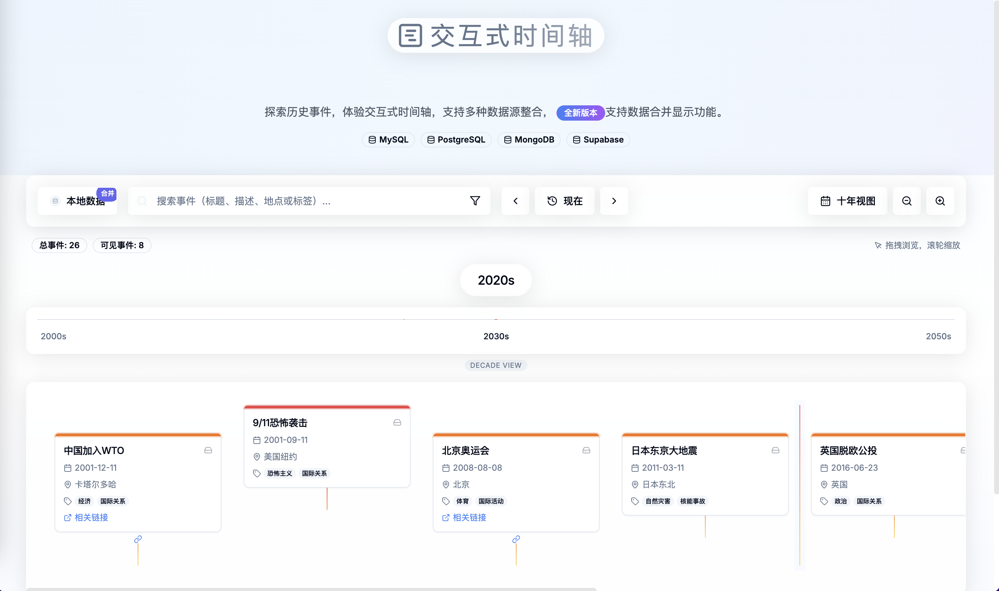

# Interactive Horizontal Timeline Project Overview

 

## Project Overview



This project is an **interactive horizontal timeline component** designed to provide a smooth time navigation experience. It is suitable for displaying historical events, news retrospectives, academic research, and more. Users can explore the timeline through **dragging, scroll zooming, and keyboard shortcuts**, and interactively view time marker details.

## Core Features

### 1. Timeline Navigation

- **Mouse drag for panning, and scroll wheel for horizontal scrolling (in days).**
- **Keyboard Support**:
  - `← / →: Move by day`
  - `Shift + ← / →: Move by month`
  - `Ctrl + ← / →: Move by year`
- **Touchscreen support: Supports **two-finger swipe**, with configurable sensitivity.**

### 2. Dynamic Zooming

- **Supports 8 levels of zoom**: Prehistoric / BCE / CE / Century / Decade / Year / Month / Day.
- **Scroll vertically to control zoom, auto-focusing on the current viewport center.**
- **Smooth zoom animation, transition time ≤300ms.**

### 3. Event Interaction

- **Single click** on event markers displays a **summary card** (title, time, priority).
- **Double click** on an event can **auto-focus** to the exact time point and zoom to the "day" level.
- **Dragging** (with permission) supports event copying and generates time comparison dashed lines.
- **Right-click menu**: Allows bookmarking, sharing, flagging controversial events, etc.

### 4. Event Management

- **Hierarchical structure**:
  - **Event set → Theme group → Main event → Related event**
  - **Independent events** can also exist directly.
- **Priority system**:
  - `P0` (historically impactful) → Forced display
  - `P1-P3` (important nodes) → Display at decade level
  - `P4-P6` (general events) → Display at year level
  - `P7+` (minor events) → Requires manual expansion

### 5. Other Features

- **Time measurement tool**: Supports **Shift + click on two events** to calculate the interval in days.
- **Intelligent search**: Can filter events by **country, year, and keywords**.
- **Multilingual support**: Chinese/English/Japanese/Russian, etc., with **machine translation**.

---

## Technology Stack

This project is developed based on a **modern front-end technology stack**, featuring high performance and scalability:

- **Vite** (fast development environment)
- **TypeScript** (static type checking)
- **React** (component-based development)
- **Tailwind CSS** (efficient style management)
- **shadcn-ui** (modern UI components)

---

## Local Development & Deployment

### 1. Local Run

Please ensure that **Node.js & npm** are installed (recommended to use [nvm](https:/github.com/nvm-sh/nvm) for management).

```sh
# Clone the repository
git clone https://github.com/AaronYang233/Timelines.git

# Enter the project directory
cd Timelines

# Install dependencies
npm i

# Start the development server
npm run dev
```

After starting, you can preview the application in the browser at `http://localhost:8080`.

### 2. GitHub Codespaces

If you wish to develop directly in the **GitHub cloud environment**:

- Click the **Code button** (green) in the **GitHub repository**.
- Select the **Codespaces tab**, then **create a new Codespace**.
- Enter the Codespace, and directly edit and submit code.

---

## Contribution Guidelines

Contributions of code and improvement suggestions are welcome! Please submit a **Pull Request** or issue, and we will address them promptly.
